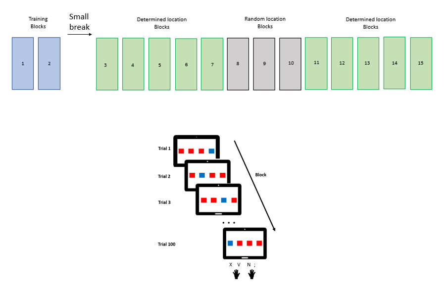

# Is there a link between temporal and spatial distance in a sequence learning/motor task?

Using a SRT (Serial Reaction Time) task, I want to modulate the spatial distance separating the four possible locations for the stimuli and the temporal distance (ISI). I would like to see if 1) each kind of distance influences sequence learning 2) if the same condition (e.g. short ISI and spatially close stimuli) facilitates performance

## METHODS

### Task
- 4 aligned red squares one of them becomes another color(target) following a sequence (defined or random);
- The target is displayed until click from participant
- ISI = self paced, either 100 ms or 140 ms after they pressed the key;
- The squares will be close together or more space on the screen
- Stimuli either follow a 10-item sequence or are randomly displayed *(without two consecutive targets at the same location)*
- 17 Blocks including 2 training blocks at the beginning
- In the middle of sequence blocks, 3 random position blocks inserted to control for habituation effect
- 4 groups of participants for the 4 condition (short/short, short/long, long/short, long/long)
- In the two training blocks, stimuli will have a medium spatial distance and medium ISI (120ms) to compare performance before the four conditions

### Analysis
I will analyse RTs and accuracy scores, between conditions but also throughout the experiment to check if 1) the sequence was learned 2) spatial or temporal distance has an influence on the performance 3) if both interact

Expected/hypothesized results;
- for every condition of distance, RTs should decrease throughout blocks and longer RT when random block inserted/Accuracy should increase if the sequence is learned
- longer ISI easier should be easier than short
- small spatial distance might reduce short ISI difficulty
