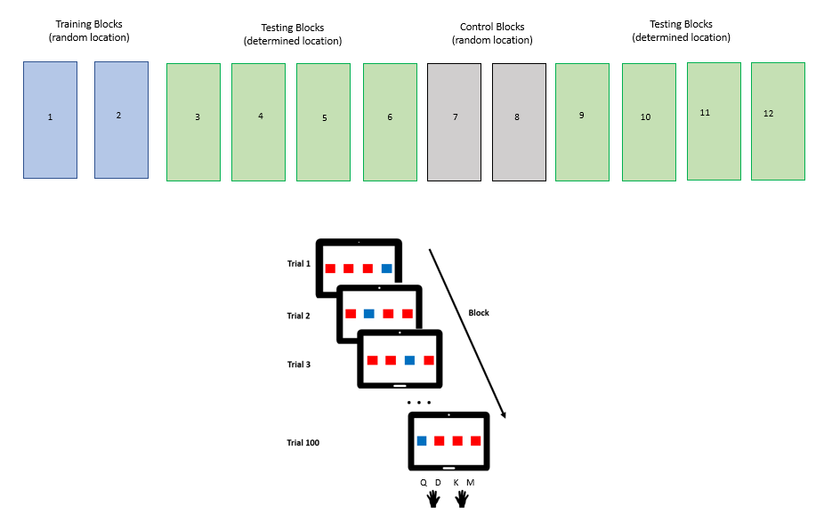

# Is there a link between temporal and spatial distance in a sequence learning/motor task?

Using a SRT (Serial Reaction Time) task, I want to modulate the spatial distance separating the four possible locations for the stimuli and the temporal distance (ISI). This task would allows to see if 1) each kind of distance influences sequence learning 2) if the same condition (e.g. short ISI and spatially close stimuli) facilitates performance.

## METHODS

### Task
- 4 aligned red squares one of them becomes another color(target) following a sequence (defined or random);
- The target is displayed until click from participant
- Display time is either of 650 ms (fast, short temporal distance) or 950 ms (slow, big temporal distance)
- The squares will be close together or more space on the screen
- Stimuli either follow a 10-item sequence or are randomly displayed *(without two consecutive targets at the same location)*
- 12 Blocks including 2 training-blocks at the beginning
- In the middle of the 8 sequence-blocks, 2 random position blocks are inserted to control for habituation effect
- 4 groups of participants for the 4 condition (short/short, short/long, long/short, long/long)


### Script Explanation
#### Load packages, stimuli
-> I first had to load several packages and set the directory
-> I checked for the screen size of my computer and set the width and height *for some reason the default zoom on windows 10 computer is set to 150% so it's important to check that it is on 100% only for the task, to set pictures on the right scale*
```
width = int(1920)
height = int(1080)

```
-> Then I had to assign the 4 images I created for the small and the 4 images for the large spatial distance to a list (as well as the Instructions and Pause pic) and made sure with the 'pygame.transform.smoothscale' that images fit the right height and width.
```
Close_pics = list()
Spaced_pics = list()
for i in range(1,5):
    img1 = pygame.image.load('Inputs/test_close_position'+str(i)+'.jpg')
    img1= pygame.transform.smoothscale(img1,(width,height))
    Close_pics.append(img1)

    img2 = pygame.image.load('Inputs/test_spaced_position'+str(i)+'.jpg')
    img2= pygame.transform.smoothscale(img2,(width,height))
    Spaced_pics.append(img2)

pic_INSTRUCTIONS = pygame.image.load('instructions.jpg')
pic_INSTRUCTIONS= pygame.transform.smoothscale(pic_INSTRUCTIONS,(width,height))

pic_pause = pygame.image.load('Inputs/pause.png')
pic_pause= pygame.transform.smoothscale(pic_pause,(width,height))

```
#### Task itself
-> I initialized pygame, set the display mode to fullscreen with a white background and launched the Clock to get the time (useful to then calculate reaction times).
```
pygame.init()
window = pygame.display.set_mode((0,0), pygame.FULLSCREEN)
window.fill(color=(0,0,0))
clock = pygame.time.Clock()

```
-> I created a list named Seq1 that contains an ordered sequence of numbers between 0 and 3 that will indicate which one of the 4 pictures is displayed, it will be used in the testing blocks.
```
Seq1 = (0,3,2,1,2,0,3,2,1,0)

```
-> Then I defined a function COND to select the allowed keys to answer to the position of the stimulus (red square). They are Q, D, K and M (on an Azerty keyboard but 'Z, D, K, ;' on a Qwerty keyboard) and respectively correspond to the red square in 1st, 2nd, 3rd or 4th position.
```
def COND(event):
    return event.type == pygame.KEYDOWN and (event.key==pygame.K_a or event.key==pygame.K_d or event.key==pygame.K_k or event.key==pygame.K_SEMICOLON )

```
##### RANDOM (Practice and Control) Blocks
-> I had to define what the practice and control blocks would be. I created a panda data frame to store the results. Then created 'i' and assigned it to 0 to keep track of the number of trial (click/event). *'i' will be between 0 and 9 (so 10 values) in the practice blocks just as a practical thing (see later SEQUENCE blocks, in those it will allow to check for the number of times the 10 item sequence is repeated, and is useful for the analysis of the data to check progression over number of repetition)*
```
def RANDOM_BLOCK(N_BLOCK,tps):
    Results = pandas.DataFrame()
    i=0
    ...
```
-> Then I displayed a first image randomly by selecting a picture of which the index was selected randomly out of the 4 possible ones.    
```
rnd = random.randint(0,3)
    window.blit(pics[rnd], (0,0))
    pygame.display.flip()

```
-> I define T0 as the time corresponding to the display of the image and T1 is set as the actual time. Then I set a condition based on time. If the participants is too slow, that is they did not react faster than the display duration (tps) the results store: the number of block, the number of trial (0 to 9), the correct answer (which picture was displayed, between 0 and 3), the key pressed (here none), reaction time (here display time) and the speed condition (value of tps specified).
```

carry_on=True
    T0 = time.time()
    while carry_on:

        T1=time.time()
        #CONDITION DE TEPS
        if T1-T0>tps and i< 10:
            Results = Results.append({'BLOCK':N_BLOCK,'TRIAL':i,'CORRECT_ANS':rnd,'KEY_PRESSED':'TIME_ELAPSED','TIME':tps,'SPEED':tps},    ignore_index=True)

```
-> Then T0 is reinitialized to actual time, and I created nextrnd which takes a random value between 0 and 3. If nextrnd's value is the same as rnd, it keeps getting assigned a new value. This ensures that the same pictures is presented twice in a row. The next presented pictures is selected in the list with the value of nextrnd as index.
```

            T0 = time.time()
            nextrnd = random.randint(0,3)
            while rnd == nextrnd:
                nextrnd = random.randint(0,3)

            window.blit(pics[nextrnd], (0,0))
            pygame.display.flip()

```
-> rnd's value is then updated with the value of nextrnd and i takes the value 'i+1' to keep track of the trial number.
```

            rnd= nextrnd
            i=i+1

```
-> Now, if the participant is too slow but it is the last trial of the 10-item sequence (even if random in this practice blocks) the loop ends.
```

            if T1-T0>tps and i==10:
                carry_on=False
                T0 = time.time()

```
-> When the participant's reaction time is shorter than the display time and thus presses a key the loop changes in such a way that if it is the trial 0 to 9, 'Key pressed' in the Results DataFrame records the key pressed (Z, D, M or ;).
```

            for event in pygame.event.get():
                if COND(event) and i< 10:
                    Results = Results.append({'BLOCK':N_BLOCK,'TRIAL':i,'CORRECT_ANS':rnd,'KEY_PRESSED':event.unicode,'TIME':T1-T0,'SPEED':tps},    ignore_index=True)
              ....

```
-> If the participant's reaction time is shorter than the display time and thus presses a key the loop changes in such a way that if it is after the last trial(9) or the 'sequence' (or if they presses Escape), the block stops.
```

                  if (event.type == pygame.KEYDOWN and event.key== pygame.K_ESCAPE) or i==10:
                      carry_on=False
                      T0 = time.time()

```
-> The image is then updated and the function returns the dataframe Results.


##### SEQUENCE (Testing) Blocks
-> I created a function for the Testing blocks that is similar to the RANDOM blocks' (also used for random blocks) one.
-> It differs as the choice of the picture is not made randomly but follows the order specified in Seq1
```

window.blit(pics[Seq1[i]], (0,0))

```
-> The conditions are slightly modified as the length of Seq1 is used instead of just precising 10
```

if T1-T0>tps and i< len(Seq1):

```
-> The correct answer stored in the results file is defined as the picture displayed, indicated by the value of the item of Seq1 indexed by i.
```
 Results = Results.append({'BLOCK':N_BLOCK,'TRIAL':i,'CORRECT_ANS':Seq1[i],'KEY_PRESSED':event.unicode,'TIME':T1-T0,'SPEED':tps},    ignore_index=True)

```

##### Pauses
-> Since the task can be exhausting, a break is offered to participants after each block (100 clicks).I thus created a function for pauses that displays the pic loaded before telling the participant it's a pause and they can press to continue. The picture is displayed until the participants presses the key 'return'.
```

def PAUSE_click():
    #WHITE SCREEN
    window.blit(pic_pause, (0,0))

    pygame.display.flip()

    carry_on=True
    while carry_on:
        for event in pygame.event.get():
            if event.type == pygame.KEYDOWN and event.key == pygame.K_RETURN:
                carry_on=False
        pygame.display.flip()
        clock.tick(100)

```

##### Instructions definition
-> I Created a function that is similar to the one for pauses but the pic displayed here containes the instructions.
```

def PAUSE_instructions():
    #WHITE SCREEN
    window.blit(pic_INSTRUCTIONS, (0,0))

    pygame.display.flip()

    carry_on=True
    while carry_on:
        for event in pygame.event.get():
            if event.type == pygame.KEYDOWN and event.key == pygame.K_RETURN:
                carry_on=False
        pygame.display.flip()
        clock.tick(100)

```

#### RUN MAIN PROGRAM
-> First create a dataframe with the right columns: number of block, trial, correct answer, key pressed, reaction time, speed.
```

Results = pandas.DataFrame(columns=['BLOCK','TRIAL','CORRECT_ANS','KEY_PRESSED','TIME','SPEED'])

```
-> I created an other separate file with a function to set up a visual interface to select the number of participant as well as the temporal and spatial distance. *SEE DESCRIPTION OF MENU INTERFACE*
The output of the MENU_SRT function is displayed. The two speed options are defined in Speeds in seconds. in Subject, speed can be 0 or 1 and this is used to then index the value of Speeds that is used, thisvalue is stored in tps.
In Subject, the column close_spaced contains either 1 or 2. If the value is 1 then close_pics (short spatial distance) will be used, if the value is 2 then spaced_pics will be used.
```

Subject = menu.MENU_SRT(window)

Speeds = (0.65, 0.95)

tps= Speeds[Subject['speed'][0]]


if Subject['close_spaced'][0]==1:
    pics = Close_pics
else:
    pics = Spaced_pics

```

-> The instructions screen is presented to the participants by calling the function PAUSE_instructions defined previously
```
PAUSE_instructions()

```

-> After the instructions the task starts. I created a list named Blocks that can contain 1s and 2s. 1s corresponds to random blocks and 2s to the specific sequence/testing blocks. Here we have 2 practice blocks, 4 seq blocks, 2 random blocks and 4 seq blocks so blocks is (1,1,2,2,2,2,1,1,2,2,2,2).

I also create N_rep as the number of times the 1O item seq(or random seq) is repeated. I wanted a the sequence to be repeated 8 times in a block to have 80 button presses.
I created n_block as the number of blocks, it iterates over the 12 values in Blocks.
```

Blocks = (1,1,2,2,2,2,1,1,2,2,2,2)
N_rep=7
n_block=1

```
-> Then I created a loop that specifies that for each value of bk (for block) in the list Blocks (either 1 or 2) the type of block that will be presented. If bk is 1 then the random/practice blocks are presented otherwise sequence/test blocks are. The loop specifies in each case that the block function will be repeated N_rep times. And then I quit pygame to end the task.
```

for bk in Blocks:
    if bk==1:
        for n in range(N_rep):
            Results = Results.append(PRACTICE_BLOCK(n_block,tps))
        PAUSE_click()
    if bk==2:
        for n in range(N_rep):
            Results = Results.append(TEST_BLOCK(n_block,tps))
        PAUSE_click()
    n_block=n_block+1

pygame.quit()

```
-> The Results file and the Subject file created from the menu are saved into csv files in a data file. Each file is named from the number of the participant (entered in the menu) and then the tyoe (results or suject).
```

Results.to_csv('C:\\Users\\Claire PLECHE\\PCBS_srt.git\\data\\'+str(Subject['ID_subj'][0])+'_Results'+'.csv',sep=';')
Subject.to_csv('C:\\Users\\Claire PLECHE\\PCBS_srt.git\\data\\'+str(Subject['ID_subj'][0])+'_Subject.csv',sep=';')

```
#### MENU INTERFACE
-> I needed a function that displays a menu in order to enter the Number of the participant, choose the temporal and spatial conditions. It's a general function with 3 embedded functions.
-> I started by loading images I created with the various choices highlited in blue ('close vs spaced' and 'fast vs slow')

```

def MENU_SRT(window):
    pic_close = pygame.image.load('Inputs/Menu_close.jpeg')
    pic_close= pygame.transform.smoothscale(pic_close,(width,height))

    pic_spaced = pygame.image.load('Inputs/Menu_spaced.jpeg')
    pic_spaced= pygame.transform.smoothscale(pic_spaced,(width,height))

    pic_fast= pygame.image.load('Inputs/Menu_fast.jpeg')
    pic_fast= pygame.transform.smoothscale(pic_fast,(width,height))


    pic_slow= pygame.image.load('Inputs/Menu_slow.jpeg')
    pic_slow= pygame.transform.smoothscale(pic_slow,(width,height))


    clock = pygame.time.Clock()
    ...

```
-> The first embedded function is to enter a numeric value of the participant's number. A string 'id' is created and a while loop specifies that for an event, if it is created with the use of the keyboard and the key used is numeric then id takes the value 'id + event'. If the participant clicks on backspace('effacer') then it erases the number previously written. When the participant presses the return ('entrée') key, then the value entered for id is selected.
```

    def id_subject():
        id = ""
        font = pygame.font.Font(None, 50)
        carry_on=True
        while carry_on==True:
            for event in pygame.event.get():
                if event.type == pygame.KEYDOWN:
                    if event.unicode.isnumeric():
                        id = id + event.unicode
                    elif event.key == pygame.K_BACKSPACE: #supprimer caractère chaine
                        id = id[:-1]
                    elif event.key == pygame.K_RETURN:
                        carry_on=False

```
-> Then it I displayed the Subject ID on the screen in a centered rectangle.
```
            window.fill((0, 0, 0))
            block = font.render('Subject ID : '+id, True, (255, 255, 255))
            rect = block.get_rect()
            rect.center = window.get_rect().center
            window.blit(block, rect)
            pygame.display.flip()

        return str(id)

```
-> The second embedded function allows to choose between close or spaced pics. The 'default' choice takes the value 1 and corresponds to the selection of close_pics(located on the left, the picture with 'close' highlited in blue). If the experimenter press on return then it is selected. However, the experimenter can press the right arrow key which will display the picture in which 'spaced' is highlighted in blue. The exeperimenter can also go back to 'close' by pressing on the left key. This can alternate indefinitely until the experimenter presses on 'Return' to select the spatial distance. Then it moves on to the other menu, to select the display time.
```

    def MENU1():
        #WHITE SCREEN
        choice = 1
        window.blit(pic_close, (0,0))

        pygame.display.flip()

        carry_on=True
        while carry_on:
            for event in pygame.event.get():
                if event.type == pygame.KEYDOWN and event.key==pygame.K_RIGHT:
                    window.blit(pic_spaced, (0,0))
                    pygame.display.flip()
                    choice=2
                if event.type == pygame.KEYDOWN and event.key==pygame.K_LEFT:
                    window.blit(pic_close, (0,0))
                    pygame.display.flip()
                    choice=1
                if event.type == pygame.KEYDOWN and event.key==pygame.K_RETURN:
                    carry_on=False
            pygame.display.flip()
            clock.tick(100)

        return choice

```
-> The function to choose between fast or slow display duration (0,65 or 0,95) is similar to the previous one. However here the default value of choice is 0 which corresponds to the fast condition. When choice equals 1, then slow condition is selected.

```

    def MENU2():
        #WHITE SCREEN
        choice = 0
        window.blit(pic_fast, (0,0))

        pygame.display.flip()

        carry_on=True
        while carry_on:
            for event in pygame.event.get():
                if event.type == pygame.KEYDOWN and event.key==pygame.K_RIGHT:
                    window.blit(pic_slow, (0,0))
                    pygame.display.flip()
                    choice=1
                if event.type == pygame.KEYDOWN and event.key==pygame.K_LEFT:
                    window.blit(pic_fast, (0,0))
                    pygame.display.flip()
                    choice=0
                if event.type == pygame.KEYDOWN and event.key==pygame.K_RETURN:
                    carry_on=False
            pygame.display.flip()
            clock.tick(100)

        return choice

```
-> The last embedded function creates a data frame with 3 columns: ID_Subj, close_spaced and speed. It then fills this data frame with the output of each of the three previous functions.
```

    def RUN_menu():
        Menu_Choices= pandas.DataFrame(columns=['ID_subj','close_spaced','speed'])
        Menu_Choices= Menu_Choices.append(  {'ID_subj':id_subject(),'close_spaced':MENU1(),'speed':MENU2()}, ignore_index=True)
        return Menu_Choices

    return RUN_menu()

```
